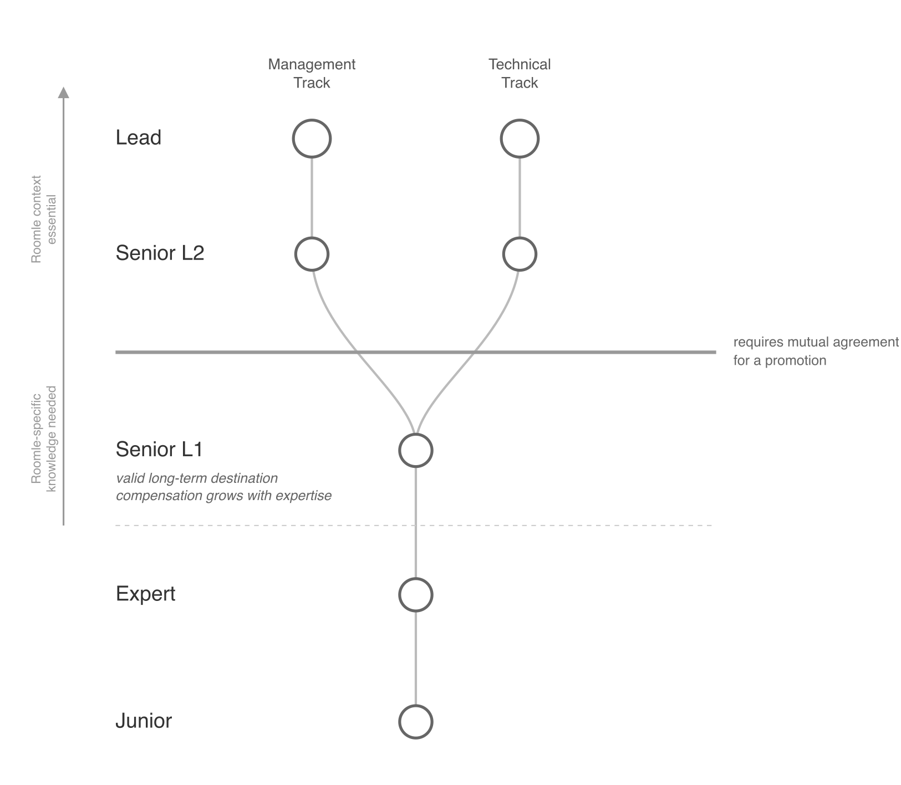
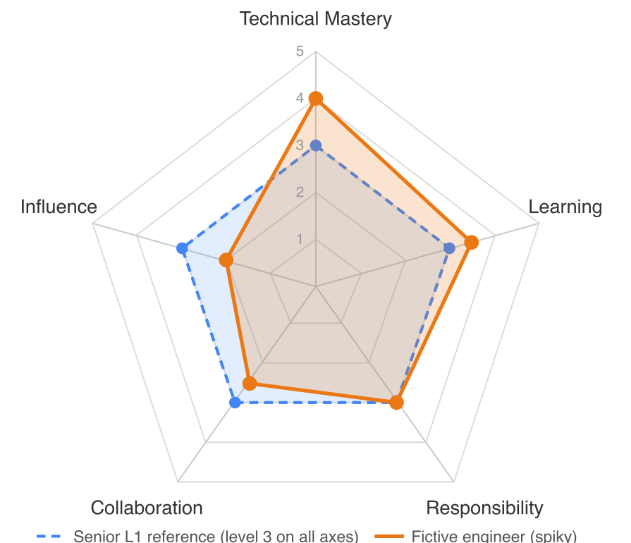

# Career Ladder – Overview

## How to read this ladder

The framework has more pages than any single read needs. Here's the order that works for most readers and why.

**Start here (you are reading it).** This page gives you the five levels and the tech/management track split at L2. Once you've skimmed the tables and graphs below, you have the shape of the whole framework.

**Then read the level pages in order, Junior → Lead.** They are cumulative: every level assumes everything from the levels below. Reading them out of order is possible but harder, because the "what's new at this level" framing leans on you having the previous level in your head.

**The framework is based on the ideas of engineeringladders.com**: every level has a description and is described along 5 axes. We deliberately chose different axes than in the original framework, but this is because we are a 30-person company and not big tech. More about the initial framework can be found here: https://www.engineeringladders.com/ (or: https://github.com/jorgef/engineeringladders)

The graphic above gives you the landscape at a glance: five levels, the track split at Senior L2, and the mutual-agreement boundary at the Senior L1 → Senior L2 transition. Keep it in the back of your mind while reading the detail pages — but don't stop here. The text covers far more than this simple diagram can communicate; the graphic is a tool for orientation, not a substitute for the level descriptions.

Each level is defined by five axes, and an engineer is evaluated against those axes. To give you an early intuition — similar to the overview graphic above — here is a fictive Senior L1 assessment plotted against the reference shape. The blue dashed line is what Senior L1 expects on every axis; the orange shape is what a real (spiky) engineer might look like. Remember: all axes must be met at the target level to be eligible for promotion. We chose Senior L1 deliberately here because it is also the level an engineer can choose to stay at long-term.

Our [Axes](axes.md) are described [here](axes.md). You may read the axes before or after the levels. This depends on your personal preferences.

- [01 Junior](<levels/01 Junior.md>) — guided contributor, primary job is to learn
- [02 Expert](<levels/02 Expert.md>) — independent, delivers reliably within their domain
- [03 Senior L1](<levels/03 Senior-L1.md>) — established senior individual contributor; the broad professional destination
- [04a Senior L2 (technical)](<levels/04a Senior-L2 (technical track).md>) and [04b Senior L2 (management)](<levels/04b Senior-L2 (management track).md>) — the multiplier split, in L2 it's about enabling others and working cross-team and cross-stakeholders.
- [05a Lead (technical)](<levels/05a Lead (technical track).md>) and [05b Lead (management)](<levels/05b Lead (management track).md>) — org-shaping; structurally rare at our size
- [99 Executive Leadership](<levels/99 Executive Leadership.md>) — explicitly *outside* the ladder; the document explains why

**Read the boundary docs only when you need them.** Each one answers "how do we tell these two adjacent levels apart?" — useful for promotion conversations and calibration, less useful as continuous reading. Pick the boundary you care about right now:

- [Junior → Expert](background/boundaries/01-junior-vs-expert.md)
- [Expert → Senior L1](background/boundaries/02-expert-vs-senior-l1.md)
- [Senior L1 → Senior L2](background/boundaries/03-senior-l1-vs-l2.md)
- [Senior L2 → Lead (technical)](background/boundaries/04-senior-l2-vs-lead-technical.md)
- [Senior L2 → Lead (management)](background/boundaries/05-senior-l2-vs-lead-management.md)

**Read role profiles when you want domain-specific expectations.** The general ladder describes competencies abstractly; role profiles spell out what those competencies look like for a specific domain.

- [Web Frontend](role-profiles/web-frontend.md) (domain) and [AI Tooling](role-profiles/ai-tooling.md) (cross-cutting — applies to every engineer).
- The remaining domains have placeholder profiles that name the surface but leave the per-level content to be defined: [Backend (RAPI)](role-profiles/backend.md), [Infrastructure & Delivery](role-profiles/infrastructure.md), [3D / Configurator (Web SDK)](role-profiles/3d-configurator.md), [Core (C/C++)](role-profiles/core-cpp.md). The placeholders exist so the ladder is structurally complete; treat them as known gaps, not endorsed content.

**Background pages are optional context.** [Company Profile](background/company-profile.md) is for external readers who don't know Roomle (and for AI Agents to understand who we are). [Engineering Context](background/engineering-context.md) explains the Rubens / Core / RAPI / HI vocabulary used in the role profiles. [Work in Progress](background/wip.md) is a placeholder for content not yet written.

## Levels at a Glance

| Level     | Operating Level         | What this means                                                          |
| --------- | ----------------------- | ------------------------------------------------------------------------ |
| Junior    | Guided contributor      | Delivers with support; primary job is to learn                           |
| Expert    | Independent contributor | Owns and delivers their work reliably                                    |
| Senior L1 | Senior contributor      | Delivers complex work reliably in their area of ownership; a valid long-term destination |
| Senior L2 | Multiplier              | Makes others better, through tech leadership or people leadership        |
| Lead      | Org shaper              | Shapes the org's technical direction or engineering culture; impact outlasts individual contributions |

## Track Split

From Senior L2 onward, the ladder splits into two tracks:

| Level | Technical Track | Management Track |
|-------|----------------|------------------|
| Senior L2 | [Technical multiplier](<levels/04a Senior-L2 (technical track).md>) — system ownership, architectural leadership | [People multiplier](<levels/04b Senior-L2 (management track).md>) — team delivery, coaching, people development |
| Lead | [Technical visionary](<levels/05a Lead (technical track).md>) — defines tech future, org-wide technical impact | [Engineering leader](<levels/05b Lead (management track).md>) — shapes org culture, talent strategy, company influence |

## Starting Level & Progression

**Most external hires start at Expert**, although they can advance fast. After 1 month and then after 3 month an assessment will take place to find the exact position in the Roomle Career Ladder. We will explain later why this is the case. The initial placement in the Roomle Career Ladder has nothing to do with salary or "Einstufung by IT KV". The Junior level is reserved for career starters (graduates, career changers, or trainees) who need structured guidance and onboarding.

**Senior L1 requires Roomle-specific knowledge; Senior L2 requires Roomle-specific *context*.** A strong engineer hired from Big Tech or another company may have the general technical skills of a Senior, but Senior L1 at Roomle additionally requires understanding our systems, our domain, our team dynamics, our ambiguity level, and our way of working. This is why most people won't headstart on Senior L1 from day 1. Concretely:

- **Beginning at Senior L1, Roomle-specific knowledge becomes very relevant.** No one is expected to write Roomle Script *and* three.js *and* the Java backend — depth lives in one or two surfaces. But an L1 is expected to *understand how the parts fit together*: how a Roomle Script change in Core surfaces through the WASM boundary into the Web SDK, how the Vue UI in roomle-ui sits on top of the SDK, how the embedding library mediates between Rubens and a customer's webshop, and where RAPI sits behind all of it. That mental model is what lets an L1 reliably helps to make decisions and also to triage whether a reported bug is content, code, integration, or a Homag-side change (see [Engineering Context](background/engineering-context.md#what-makes-roomle-hard)).
- **At Senior L2, Roomle context becomes one of the main requirements.** Multiplier work — team-wide standards, cross-surface architecture, leading initiatives that span engineers other than themselves — is only credible when the person decides with full awareness of the Roomle landscape: who owns which surface, where the Homag-dev counterparts sit, what the embedding contract guarantees to customers, what the 30-person-product-unit-inside-a-~7,000-person-industrial-group reality actually means for trade-offs. An L2 without Roomle context will optimize for the wrong thing.

Roomle's experience is that seniority from other companies does not automatically translate into Roomle Senior performance from day one: people from highly specialized, process-heavy environments can struggle with the autonomy, breadth, and context-switching expected here. Not every engineer is used to **messy boundaries** and can handle them on day one. But our experience is, that skilled engineers can grow into Roomle-context seniority quickly. This is not a demotion; it is an acknowledgment that seniority is partly contextual.

**Internal level decisions are based on demonstrated capability, not on time elapsed.** Someone is eligible for promotion when the underlying capability is demonstrated. Conversely, time alone is not a promotion criterion — sustained performance at the next level's expectations is what triggers a level change. The expected pace of growth is a guide for what the regular performance review looks for, not a calendar guarantee in either direction. This is intentionally constructed differently to the underlying IT-KV. The IT-KV advance will happen as defined in the IT-KV.

**The Senior L1 → Senior L2 transition is a deliberate choice.** Moving from L1 to L2 is not automatic — it requires mutual agreement. L2 brings a different kind of work: multiplier responsibilities (team standards, architecture across the team, growing others) on top of strong individual delivery. Anyone choosing this path should be aware that once at L2, the company commits to growing the person toward Lead-level responsibilities over time, and the engineer commits to taking that growth seriously. This is a significant mutual commitment and should be discussed openly before promotion.

**Staying at Senior L1 is a valid choice.** Not every engineer wants — or needs — to become a multiplier. Some of our strongest engineers choose to stay at Senior L1 long-term because they enjoy what they do and don't want the broader responsibilities of Senior L2. This is fully respected. It is also a structural reality: a ~30-person company cannot sustain everyone at the Lead level. Senior L1 is a destination, not just a way station.

**Compensation growth is possible at Senior L1 without moving to Senior L2.** Senior L1 is not a salary ceiling. An engineer who becomes a recognized deep expert in a Roomle surface — Core (Roomle Script, the C/C++ rules engine), the Web SDK (three.js / AR / rendering), the embedding library, RAPI, Homag Intelligence, Infrastructure & delivery, or who defines their own new surface — can be compensated above the regular Senior L1 range while remaining at Senior L1. The L1 → L2 step is about taking on multiplier responsibilities (team standards, architecture across the team, growing others), not about being more technically expert. Some of the strongest individual experts in the company are L1 and intentionally stay there; their depth is rewarded through salary, not through a forced move into a multiplier role they don't want.

## Roomle Technical Surfaces

Engineers grow depth in one or more of these surfaces. When level pages and boundary docs say *"their area"* or *"their domain"*, they mean one of the following. Full descriptions in [Engineering Context](background/engineering-context.md).

| Surface                                           | What it covers                                                                                                                                                                            | Current shape                                                                  |
| ------------------------------------------------- | ----------------------------------------------------------------------------------------------------------------------------------------------------------------------------------------- | ------------------------------------------------------------------------------ |
| **Rubens** (Room Designer / Configurator / Admin) | The user-facing 3D product, including the Vue 3 frontends in *roomle-ui* and the Ember.js *Rubens Admin* customer back-office                                                             | Team of ~5 web engineers, broad surface coverage                               |
| **Web SDK**                                       | three.js, the canvas, real-time 3D graphics, AR; the rendering library the Vue UI sits on top of                                                                                          | Part of web; one engineer specializes in 3D/AR, others support                 |
| **Embedding library**                             | Instantiates Rubens inside customer webshops in an iframe; handles cross-frame `postMessage` and serialization                                                                            | Part of web; touched by anyone who works on customer integrations              |
| **Core**                                          | C/C++ rules engine — Roomle Script interpreter, collision detection, placement constraints, interaction rules and more. Cross-compiled to WASM (browser) and server                       | Single engineer; also works across web                                         |
| **RAPI**                                          | Java REST backend — catalog, tenants, content, persistence. Single backend for all Roomle products; "CMS of Roomle Data", at the moment (May 2026) minimal role inside Homag Intelligence | Team of 3                                                                      |
| **Homag Intelligence (HI)**                       | The Homag-content variant of Rubens Room Designer (calc.js + glue layer); engineering work spans Rubens, Web SDK, embedding, and a direct Roomle-dev ↔ Homag-dev channel                  | Cross-cutting; anyone working HI surfaces must hold the Homag-dev conversation |
| **Infrastructure & delivery**                     | GCP, Kubernetes, Docker, observability, build/release pipelines, access & account management, cloud cost governance; stand-in for Lead of Product Operations on ServiceDesk               | Single DevOps engineer; RAPI engineers support if needed                       |
| **iOS**                                           | Native iOS app (since 2013); maintained for steady revenue, not a strategic growth area                                                                                                   | Single iOS engineer                                                            |
| **DAP**                                           | Digital asset pipeline                                                                                                                                                                    | Adjacent to RAPI and Core                                                      |

**Single-engineer surfaces (Core, iOS, DevOps...) are a structural reality.** The ladder does not require these engineers to mentor inside their surface (no one is there); their multiplier behavior expresses across surfaces or in adjacent surfaces. See the team-of-one paragraph in [L1 vs L2 boundary](background/boundaries/03-senior-l1-vs-l2.md). Cross-surface depth (e.g., the Web + Core engineer) is explicitly welcomed — see [Engineering Context → Team shape](background/engineering-context.md#team-shape).

## Technical Track vs Management Track

From Senior L2 onward, the ladder offers two equally senior, equally valuable tracks, just with a different focus.

### What they own

| | Technical Track | Shared | Management Track |
|---|---|---|---|
| **Owns** | System & architecture | Roadmap & process | People & delivery |
| **Decisions** | *How* to build it | *What* to build | *Who* builds it & *when* |
| **Quality means** | Code, architecture, reliability | Standards, practices | Team health, sustainable pace |
| **Grows others by** | Teaching, reviewing, pairing | Setting expectations | Coaching, feedback, career planning |
| **Time allocation** | 50–70% hands-on | — | Player-Coach (depends on team size, up to 50% hands-on) |

### What they do day-to-day

| Activity | Technical Track | Management Track |
|----------|----------------|------------------|
| Architecture decisions | Drives & decides | Participates, asks good questions |
| Code reviews | Active reviewer, sets standards | Occasional, not on critical path |
| 1:1s with team members | Informal, technical mentoring | Structured, career & wellbeing focused |
| Hiring | Evaluates technical depth | Owns hiring process & team composition |
| Cross-team coordination | Technical alignment & dependencies | Stakeholder management & priorities |
| Performance issues | Flags concerns, provides evidence | Owns the conversation & resolution |
| Production incidents | Leads technical response | Shields team, communicates to stakeholders |
| Planning | Estimates, scopes, identifies risks | Prioritizes, staffs, manages capacity |

Neither track is "above" the other. In small teams, one person may cover both, but as teams grow, these responsibilities should be separated.

**At Roomle's current size (~30 people), the management track is largely aspirational.** Today, most senior engineers who take on people responsibilities do so as player-coaches — they still write code and own technical outcomes while also coaching, hiring, and running 1:1s. The track is defined now so the framework doesn't need to be rewritten when the company grows and dedicated engineering-management roles become necessary. If you're reading the management-track level pages and thinking "we don't have anyone who does this full-time" — that's the reality.

---

### Stage Verbs by Level

| | Technical Mastery | Learning | Responsibility | Collaboration | Influence |
|---|---|---|---|---|---|
| **Junior** | Applies | Adopts | Acknowledges | Contributes | Observes |
| **Expert** | Solves | Grows | Owns | Collaborates | Contributes |
| **Senior L1** | Designs | Explores | Drives | Facilitates | Influences |
| **Senior L2** | Masters | Educates | Empowers | Leads | Leads |
| **Lead** | Creates | Evangelizes | Mentors | Advocates | Shapes |

---

## Evaluation & Aggregation Rule

When evaluating an engineer for a level (e.g., for promotion to Senior L1), managers must look at up to three artifacts:
1. **The Core Ladder** (e.g., `03 Senior-L1.md`)
2. **The Domain Profile** (e.g., `web-frontend.md`)
3. **Cross-Cutting Profiles** (e.g., `ai-tooling.md`)

**The Rule**: To achieve a level, an engineer must meet the expectations outlined in **all applicable artifacts** for that level. The domain and cross-cutting profiles are not optional extras; they are mandatory extensions of the core ladder (primarily mapping to the *Technical Mastery* and *Learning* axes).

For example, if utilizing AI tooling efficiently is defined as table stakes for a Senior L1 in 2026, an engineer must meet the Senior L1 criteria in the AI Tooling profile in order to be recognized as a Senior L1 overall. If an engineer is Senior L1 in Web Frontend but only operates at Expert level in AI Tooling, they have not yet met the bar for Senior L1 overall. This prevents the "leakage" of critical modern technical skills.

### Nuance: the rule has a deliberate backdoor

A strict "all axes, all artifacts, all the time" reading would make the framework brittle. Real engineers are spiky, profiles age, and the ladder is supposed to support honest conversations — not become a checkbox audit. Two explicit nuances apply:

1. **Documented growth plan instead of a provisional promotion.** If an engineer clearly meets the level on 4 of 5 axes (or on the core ladder but not yet on one cross-cutting profile), promotion does not happen until the gap is closed. Instead, the engineer and their manager agree on a *concrete*, *time-boxed*, *documented* growth plan with a defined check-in date (typically 3–6 months). Title and salary stay at the current level during the growth plan. At the check-in: either the gap is closed and the promotion happens then, or the plan is revised and the next check-in is set. There is no "provisional title" — the title and salary follow the confirmed capability, not the intent to grow into it.
2. **Compensating strength is acknowledged, but does not waive a missing axis.** An engineer who is exceptionally strong on Technical Mastery does not thereby meet the Influence bar. However, exceptional depth *can* justify a higher salary at the current level (see [Compensation growth is possible at Senior L1…](#starting-level-progression)). The career step and the compensation step are two different conversations — the backdoor is in compensation, not in the level definition.

Both nuances require **written documentation** (in the engineer's review record). The backdoor is not informal manager discretion; it is a tracked decision with a date attached. If a manager finds themselves wanting a third type of exception, that is a signal to re-examine the level definition itself, not to widen the backdoor.
