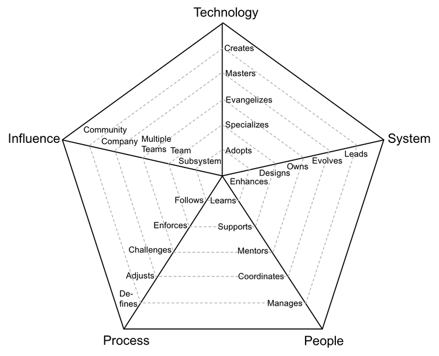
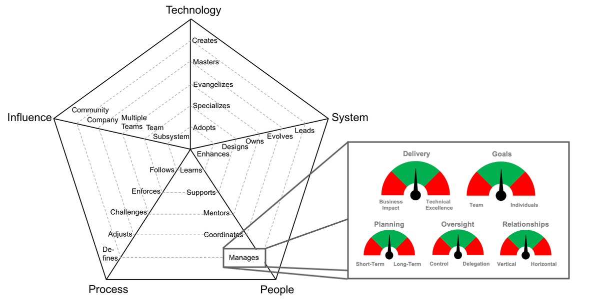

# Engineering Ladders – Summary

> Source: [engineeringladders.com](https://www.engineeringladders.com/) by [jorgef](https://github.com/jorgef/engineeringladders)
>
> Full repo downloaded to [engineeringladders/](./engineeringladders/) (Apache 2.0 License). Key files:
> - [README.md (Introduction)](./engineeringladders/README.md)
> - [Developer.md](./engineeringladders/Developer.md)
> - [TechLead.md](./engineeringladders/TechLead.md)
> - [TechnicalProgramManager.md](./engineeringladders/TechnicalProgramManager.md)
> - [EngineeringManager.md](./engineeringladders/EngineeringManager.md)
> - [TechLead-EngineeringManager.md](./engineeringladders/TechLead-EngineeringManager.md)
> - [Managing-Managers.md](./engineeringladders/Managing-Managers.md)
> - [charts/](./engineeringladders/charts/) (radar chart PNGs + PowerPoint source)

## Overview

A framework for engineering managers to have meaningful conversations with their direct reports around career expectations and growth planning. It uses **radar charts** to visually represent expectations of each position across 5 axes.

The framework is meant as a **baseline** — every company should adjust it to their needs.

---

## Career Ladders

The framework defines **4 ladders** (roles):

| Ladder | Description | Details |
|--------|-------------|---------|
| **Developer** | Programmer / software engineer; requires deep technical expertise | [Developer.md](./engineeringladders/Developer.md) |
| **Tech Lead** | Dev lead; owner of the system; balance of hands-on dev, architecture, and production support | [TechLead.md](./engineeringladders/TechLead.md) |
| **Technical Program Manager (TPM)** | Coordinates and drives cross-team initiatives to completion | [TechnicalProgramManager.md](./engineeringladders/TechnicalProgramManager.md) |
| **Engineering Manager** | Dev manager; responsible for consistent delivery, career growth, and team happiness | [EngineeringManager.md](./engineeringladders/EngineeringManager.md) |

### Level Matrix

| Level | Senior | Developer | Tech Lead | TPM | Eng. Manager |
|-------|--------|-----------|-----------|-----|--------------|
| 1 | No | D1 | – | – | – |
| 2 | No | D2 | – | – | – |
| 3 | No | D3 | – | – | – |
| 4 | Yes | D4 | TL4 | TPM4 | – |
| 5 | Yes | D5 | TL5 | TPM5 | EM5 |
| 6 | Yes | D6 | TL6 | TPM6 | EM6 |
| 7 | Yes | D7 | TL7 | TPM7 | EM7 |

- Levels 1–3 are individual contributor only (Developer track)
- Level 4+ is considered "Senior" and splits into multiple tracks
- Engineering Manager starts only at level 5

---

## The 5 Axes

Each position is evaluated along 5 axes, each with 5 levels of performance (each level includes the previous ones):

### 1. Technology

| Level | Name | Description |
|-------|------|-------------|
| 1 | **Adopts** | Actively learns and adopts the technology and tools defined by the team |
| 2 | **Specializes** | Go-to person for one or more technologies; takes initiative to learn new ones |
| 3 | **Evangelizes** | Researches, creates proofs of concept, introduces new technologies to the team |
| 4 | **Masters** | Very deep knowledge about the whole technology stack of the system |
| 5 | **Creates** | Designs and creates new technologies widely used by internal or external teams |

### 2. System

| Level | Name | Description |
|-------|------|-------------|
| 1 | **Enhances** | Successfully pushes new features and bug fixes to improve and extend the system |
| 2 | **Designs** | Designs and implements medium to large features while reducing tech debt |
| 3 | **Owns** | Owns the production operation and monitoring of the system; aware of its SLAs |
| 4 | **Evolves** | Evolves the architecture to support future requirements; defines SLAs |
| 5 | **Leads** | Leads the technical excellence of the system; creates plans to mitigate outages |

### 3. People

| Level | Name | Description |
|-------|------|-------------|
| 1 | **Learns** | Quickly learns from others and consistently steps up when required |
| 2 | **Supports** | Proactively supports other team members and helps them be successful |
| 3 | **Mentors** | Mentors others to accelerate their career growth; encourages participation |
| 4 | **Coordinates** | Coordinates team members; provides effective feedback; moderates discussions |
| 5 | **Manages** | Manages team members' career, expectations, performance, and happiness |

### 4. Process

| Level | Name | Description |
|-------|------|-------------|
| 1 | **Follows** | Follows team processes; delivers a consistent flow of features to production |
| 2 | **Enforces** | Enforces team processes; ensures everyone understands benefits and tradeoffs |
| 3 | **Challenges** | Challenges team processes; looks for ways to improve them |
| 4 | **Adjusts** | Adjusts team processes; listens to feedback; guides the team through changes |
| 5 | **Defines** | Defines the right processes for the team's maturity; balances agility and discipline |

### 5. Influence

| Level | Name | Description |
|-------|------|-------------|
| 1 | **Subsystem** | Makes an impact on one or more subsystems |
| 2 | **Team** | Makes an impact on the whole team, not just specific parts |
| 3 | **Multiple Teams** | Makes an impact not only on own team but also on other teams |
| 4 | **Company** | Makes an impact on the whole tech organization |
| 5 | **Community** | Makes an impact on the tech community |

The **Influence** axis is orthogonal — it applies to all other axes as a "different dimension."

---

## Developer Ladder (D1–D7)

| Level | Technology | System | People | Process | Influence |
|-------|-----------|--------|--------|---------|-----------|
| D1 | Adopts | Enhances | Learns | Follows | Subsystem |
| D2 | Adopts | Designs | Supports | Enforces | Subsystem |
| D3 | Specializes | Designs | Supports | Challenges | Team |
| D4 | Evangelizes | Owns | Mentors | Challenges | Team |
| D5 | Masters | Evolves | Mentors | Adjusts | Multiple Teams |
| D6 | Creates | Leads | Mentors | Adjusts | Company |
| D7 | Creates | Leads | Mentors | Adjusts | Community |

---

## Tech Lead Ladder (TL4–TL7)

| Level | Technology | System | People | Process | Influence |
|-------|-----------|--------|--------|---------|-----------|
| TL4 | Specializes | Owns | Coordinates | Adjusts | Subsystem |
| TL5 | Evangelizes | Evolves | Coordinates | Defines | Team |
| TL6 | Masters | Leads | Coordinates | Defines | Multiple Teams |
| TL7 | Masters | Leads | Coordinates | Defines | Company |

---

## Technical Program Manager Ladder (TPM4–TPM7)

| Level | Technology | System | People | Process | Influence |
|-------|-----------|--------|--------|---------|-----------|
| TPM4 | Specializes | Designs | Coordinates | Adjusts | Multiple Teams |
| TPM5 | Specializes | Designs | Coordinates | Defines | Multiple Teams |
| TPM6 | Specializes | Owns | Manages | Defines | Company |
| TPM7 | Specializes | Evolves | Manages | Defines | Community |

---

## Engineering Manager Ladder (EM5–EM7)

| Level | Technology | System | People | Process | Influence |
|-------|-----------|--------|--------|---------|-----------|
| EM5 | Evangelizes | Owns | Manages | Adjusts | Team |
| EM6 | Evangelizes | Evolves | Manages | Defines | Team |
| EM7 | Evangelizes | Evolves | Manages | Defines | Multiple Teams |

---

## Tech Lead vs Engineering Manager

> See full comparison: [TechLead-EngineeringManager.md](./engineeringladders/TechLead-EngineeringManager.md)

Both roles overlap but have different focus:

- **Tech Lead** → in charge of the **System**
- **Engineering Manager** → in charge of the **People**

| Tech Lead (System) | Engineering Manager (People) |
|--------------------|------------------------------|
| Technical Excellence and Innovation | Career Planning, Promotions and Coaching |
| Architecture and System Integration | Headcount Planning and Hiring |
| Tech Mentoring, Adoption and Alignment | Team Planning and Delivery |
| Technical Spikes and Experiments | Objectives, Performance and Feedback |
| Code Reviews and Feedback | One on Ones |
| System Design Presentations | Participation in Technical Decisions |
| Technical Capacity Planning | Cascading Communications |
| Production Issues Escalation | Team Building Activities and Culture |
| System SLAs, Metrics & Monitoring | Team Protection and Happiness |
| Platform Direction, Patterns and Practices | Team Productivity and Metrics |
| Alignment with other Tech Leads | Alignment with other Dev Managers |
| Hands-On Coding 30%–70% of the Time | Hands-On Coding 0%–30% of the Time |

**Shared responsibilities:** System Roadmap, Development Process, Team Visibility and Recognition.

In small teams or with very experienced leaders, one person may perform both roles. As team/system grows, they should be separated.

---

## Managing Managers

> See full details: [Managing-Managers.md](./engineeringladders/Managing-Managers.md)

For higher-level managers with manager direct reports, the framework evaluates **5 balance areas**:

### 1. Delivery
Balancing business impact / speed vs. technical excellence / quality.

### 2. Goals
Balancing team goals (business needs, team expectations) vs. individual goals (career focus, personal interests).

### 3. Planning
Balancing short-term (weekly plans, spikes, quick fixes) vs. long-term (quarterly plans, proper designs, sustainable solutions).

### 4. Oversight
Balancing control (micromanaging, connected to details, auditing) vs. delegation (empowerment, big picture, trust).

### 5. Relationships
Balancing vertical relationships (managing up/down: supervisors, direct reports, indirect reports) vs. horizontal relationships (managing across: stakeholders, peers, users).

**Key insight:** Managers should balance each area sustainably over time. The "green zone" is a range, not a single point — but extremes should be avoided.

---

## FAQs

- **Not meeting all points?** Normal — use as guidance for career conversations, not a promotion checklist.
- **When ready for next level?** Perform at next level consistently for several months before formalizing.
- **How to collect evidence?** 1:1 conversations, peer feedback, self-evaluation.
- **Specific behavior examples?** Teams should define their own based on their system/tech stack.
- **Why stop at level 7?** Levels 8+ vary drastically between companies.

## Recommended Resources

- *The Manager's Path* by Camille Fournier
- *How to Be Good at Performance Appraisals* by Dick Grote

---

## Customization Assets

The repo includes a PowerPoint file ([charts/charts.pptx](./engineeringladders/charts/charts.pptx)) containing all radar chart templates — useful for creating custom charts adapted to Roomle's career ladder.
