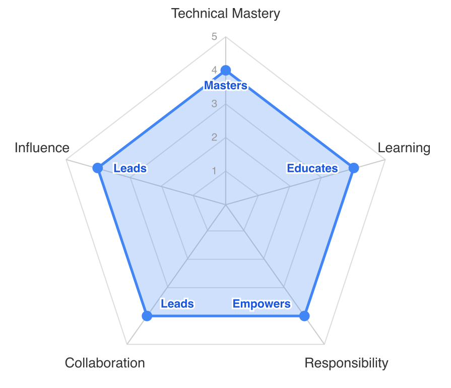

# 04a Senior L2 (Technical Track)

Technical position → counterpart: [04b Senior-L2 (management track)](04b%20Senior-L2%20(management%20track).md)

Technical multiplier

> A Senior L2 on the technical track has mastered their domain and now multiplies their impact through others. They lead larger technical initiatives, mentor team members, provide cross-team technical guidance, and drive the technical direction within their area. They are trusted to make decisions that affect the whole team and beyond.
>
> This level is where active technical leadership across the team begins — team-wide architectural ownership, defining and maintaining technical standards, and leading cross-cutting initiatives. That shift in accountability is what distinguishes Senior L2 (technical) from Senior L1.

_Boundaries: [Senior L1 → Senior L2](../background/boundaries/03-senior-l1-vs-l2.md) · [Senior L2 → Lead](../background/boundaries/04-senior-l2-vs-lead-technical.md)._

## Skill radar

## Technical Mastery
**tldr;** A Senior L2 (technical) has deep mastery across the full technology stack in their domain, drives technical decisions that affect the team, researches and introduces new technologies, and is the recognized authority for architectural questions in their area.

* **Deep stack mastery**: has very deep knowledge about the whole technology stack of the system in their area. Understands not just how things work but *why* they were built that way, and what the alternatives would have been.

* **Architectural ownership**: owns the technical architecture in their area. Evaluates and decides on technology choices, balancing innovation with stability. Understands how their systems fit into the broader product and infrastructure landscape — at Roomle this means knowing where the RAPI ↔ Web SDK ↔ Core ↔ embedding seams sit and what assumptions cross each one.

* **Research and innovation**: researches, creates proofs of concept, and introduces new technologies to the team. Evaluates emerging technologies against the team's real needs (not hype-driven). Can articulate the costs and benefits of adopting something new.

* **Technical decision-making**: trusted to make significant technical decisions autonomously. Knows when a decision needs broader consultation and when they can move forward. Documents decisions (ADRs, Confluence or similar) so the team understands the rationale.

* **Quality at scale**: defines and evolves quality standards that go beyond their own code. Establishes testing strategies, performance budgets, and reliability targets for the systems they own. Ensures technical excellence across the team's output, not just their own.

* **System thinking**: understands the production system holistically, monitoring, SLAs, failure modes, scalability limits. Can reason about system behavior under stress and plan for growth.

* **Technical debt strategy**: doesn't just identify tech debt (Senior L1) but develops and drives strategies to address it at a system level. Knows how to prioritize debt repayment against feature work and can sell this to stakeholders.

* **Team-wide automation**: identifies recurring friction across the team — not just their own tedious tasks — and drives automation that the whole team adopts. Shares the resulting tooling so it stops being one person's pet project.

* **Security posture**: enforces security standards across their area (e.g., dependency vulnerability management, secure CI/CD pipelines). Understands and defends the security and trust boundaries (e.g., between Roomle and Homag).

## Learning
**tldr;** A Senior L2 (technical) actively educates others, brings new knowledge into the team through structured formats, and creates learning opportunities for the team.

* **Educates**: can teach complex topics to others in a structured way. Creates documentation, gives internal talks, or runs workshops that raise the team's overall knowledge.
* **Structured knowledge sharing**: establishes patterns for how the team learns together — whether through tech talks, reading groups, pair programming rotations, or innovation days.
* **External awareness**: stays connected to the broader tech community as part of their role — attending conferences, reading industry publications, or engaging with professional networks during work hours. Brings external perspectives back to the team to inform technical decisions.
* **Cross-domain curiosity**: actively learns about adjacent domains (e.g., a frontend engineer exploring infrastructure, or a backend engineer understanding UX principles). Uses this broader knowledge to make better technical decisions.

## Responsibility and Ownership
**tldr;** A Senior L2 (technical) leads larger technical initiatives, empowers others to take ownership, mentors team members, and provides technical advice that impacts beyond their immediate area.

* **Leads larger initiatives**: can and is trusted to lead cross-cutting technical initiatives (e.g., major refactors, platform migrations, new system introductions). Scopes, plans, and drives these to completion.
* **Empowers others**: delegates meaningful work to others and trusts them to deliver. Provides the right level of guidance without micromanaging. Grows others' autonomy by giving them stretch opportunities.
* **Mentors**: formally and informally mentors other engineers. Helps them navigate technical challenges, career growth, and professional development. Is sought out for advice.
* **Cross-team technical advice**: provides technical guidance that impacts other teams or the company at large. At Roomle that includes the Roomle ↔ Homag-dev engineering interface: Senior L2 (technical) on an HI-relevant surface is expected to identify their Homag-dev counterpart and own that conversation, not delegate it upward.
* **Proactive vision**: brings their own technical vision for how systems and practices should evolve. Doesn't wait for direction, proposes improvements and gets buy-in from stakeholders.
* **Holds others accountable**: not just themselves (Senior L1), ensures the team maintains high standards. Addresses quality issues constructively and directly.
* **Delegation and trust**: knows when to trust others, when to work together, and when to step in. Effectively distributes work within the team based on people's strengths and growth areas.
* **Reliable delivery of complex work**: regularly delivers complex, multi-week initiatives on time. Can manage uncertainty and adjust plans when requirements shift.

## Collaboration and Communication
**tldr;** A Senior L2 (technical) leads technical discussions, builds buy-in across the organization for technical initiatives, represents the team externally, and actively grows others' communication skills.

* **Lobbying and buy-in**: actively communicates their ideas and knows how to get organizational buy-in. Can rally people behind a technical direction. Knows how to frame technical needs in business terms.
* **Represents the team**: trusted to interact with and represent the team with other stakeholders (other teams, management, external partners) to drive technical decisions.
* **Leads technical discussions**: moderates architecture discussions, design reviews, and technical planning sessions. Ensures all voices are heard and brings discussions to actionable conclusions.
* **Cross-team collaboration**: works effectively across team boundaries. Identifies dependencies, coordinates with other teams, and resolves technical conflicts.
* **Enabler**: lifts the skills and expertise of those around them. Grows others to take over existing responsibilities. Makes the whole team more capable, not just themselves.
* **Stakeholder communication**: can present technical concepts, tradeoffs, and recommendations to non-technical stakeholders in a way that enables good decision-making.
* **Conflict resolution**: can mediate technical disagreements within the team. Helps find compromises that respect both technical correctness and pragmatic needs.

## Influence
**tldr;** A Senior L2 (technical) sets technical direction at the project/team level, influences beyond their immediate team, and ensures the team's work is visible to the broader organization.

* **Sets direction**: sets technical direction at the project and team level. Consistently influences decision-making beyond just their own work.
* **Cross-team impact**: their work and decisions have an impact beyond their own team. Other teams seek their input on technical matters.
* **Visibility**: knows how to ensure that the team's work, especially technical improvements and maintenance, is visible to the whole company (dev-team, business, and management). Can market technical work effectively.
* **Engagement beyond engineering**: engages with other parts of the company beyond software engineering. Understands how technical decisions affect business outcomes.
* **Trusted representative**: trusted to represent the team's technical perspective in cross-functional discussions and planning sessions.
* **Shapes team practices**: actively improves how the team works, tooling, processes, standards, and gets buy-in for changes.
* **Role model**: others look to them as an example of technical excellence combined with pragmatism and professionalism.

## Team-of-one surfaces

For engineers whose primary surface is staffed by one person (Core, iOS, DevOps), the multiplier expectations at L2 are read *across* surface boundaries:

- **Mentoring** happens across surfaces — a Core engineer running a structured 1:1 with a Web engineer who is becoming the second person able to touch Roomle Script, or a DevOps engineer mentoring a Backend engineer toward shared on-call. The L2 entry criterion *"structured mentoring for  multiple months"* applies — the surface boundary is not an excuse to skip it.
- **Cross-cutting initiatives** the L2 leads pull other surfaces along — a Core engineer aligning Web, Backend, and Content Service on a Roomle Script change; a DevOps engineer driving a delivery-pipeline change adopted across teams.
- **Team-wide standards** owned are ones the surface contributes to — e.g., the SDK API contract Core publishes for Web consumers, or the release-pipeline conventions DevOps maintains for all of engineering.
- See the L2 entry criteria treatment in [Senior L1 → Senior L2](../background/boundaries/03-senior-l1-vs-l2.md#l2-entry-criteria).

The expectation is not waived for team-of-one surfaces; it is read across boundaries.
