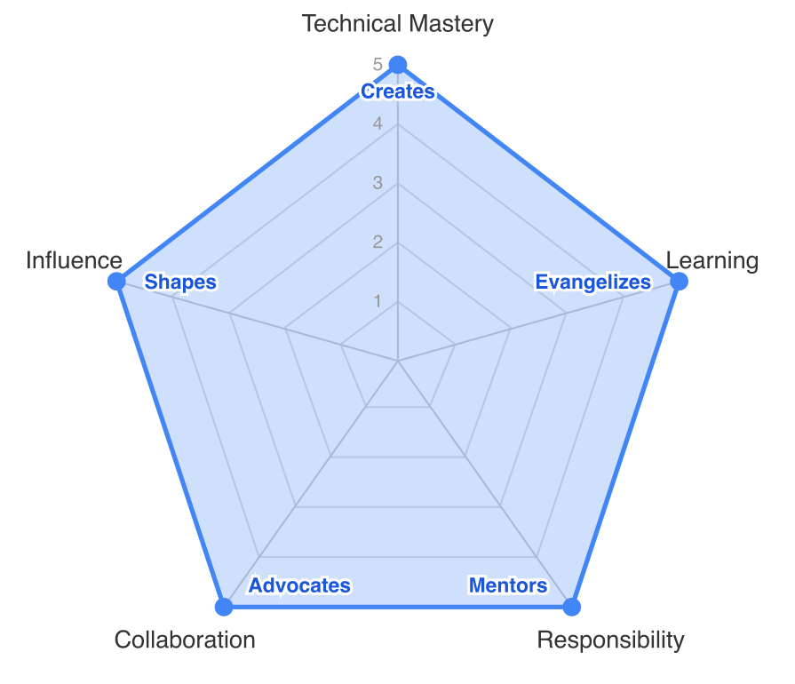

# 05b Lead (Management Track)

Management position → counterpart: [05a Lead (technical track)](05a%20Lead%20(technical%20track).md)

Engineering leader (operational, mid-term)

> A Lead on the management track is the highest people-leadership level **inside this career ladder**. They own the **operational** running of multiple teams or a substantial cross-team area on a **1–2 quarter horizon**: quarterly delivery, mid-term technical direction within their scope, day-to-day people management, and *surfacing* the structural decisions that Head of Engineering then *owns*. A Lead reports into Head of Engineering. They are the *operational* engineering leader, not the *strategic* one.

> **Roomle today.** The only filled Lead-mgmt role in engineering is **Lead of Product Operations**. Other Lead-mgmt seats are framework-defined but unfilled. The strategic, year-plus, and corporate-facing layer (technology strategy, headcount strategy, restructuring decisions, Homag/Dürr-corporate relationship) sits with **Head of Engineering** — explicitly outside this ladder; see [99 Executive Leadership](99%20Executive%20Leadership.md).

> **Working rule:** *Lead initiates and runs; Head of decides.* Wherever an organizational decision (restructure, termination, headcount, year-plus strategy, corporate-level Homag conversation) is involved, the Lead surfaces it, builds the case, and runs the conversation — the formal decision sits with Head of Engineering.

_Boundary: [Senior L2 → Lead](../background/boundaries/05-senior-l2-vs-lead-management.md)._

## Skill radar

> **Note on the radar shape.** The reference shape is identical to the [technical track](05a%20Lead%20%28technical%20track%29.md) at this level — the verbs are by level, not by track. The track difference lives in the prose below: where the work actually happens day-to-day. Collaboration and Influence weigh heavier here; Technical Mastery is exercised through operational judgment, not hands-on implementation.

## Technical Mastery
**tldr;** A Lead (management) uses solid technical understanding to make **mid-term operational decisions** across multiple teams. They are not the deep technical authority — that role sits with Lead (technical) or with strong L2s — but their technical judgment is good enough to plan a 1–2 quarter delivery arc, evaluate the decisions their teams are making, and tell Head of Engineering what investments are needed.

* **Operational technical judgment**: makes mid-term technical decisions across their teams — quarterly delivery plans, technical direction within their scope, where the team-of-teams should spend its next two quarters. Year-plus technology strategy (platform rewrites, major framework shifts) is escalated to Head of Engineering and Lead (technical), not decided unilaterally.

* **Evaluates technical work**: can assess the quality of technical decisions being made by their teams. Asks the right questions in design reviews and quarterly planning to surface risk without needing to read every line of code.

* **Contributes to technology strategy**: feeds the strategic conversation owned by Head of Engineering and Lead (technical) — what's hurting their teams, where investment would unlock multi-team delivery, where mid-term tech direction needs alignment. Does not own technology strategy.

* **Runs hiring loops**: evaluates engineering talent across roles and seniority levels; runs interview loops and gives reliable hire/no-hire judgment. **Headcount strategy, employer brand, and the formal offer decision sit with Head of Engineering.**

* **System awareness**: maintains a working understanding of the systems their teams own — enough to make informed operational decisions about dependencies, sequencing, and resourcing. Relies on technical leads for depth.

* **Security & privacy execution**: ensures the security and privacy practices that exist at the org level are actually *running* inside their teams — that GDPR-relevant work has owners, that vulnerability handling lands, that dependency hygiene happens. The *org-level* security posture (policy, corporate audit, vendor risk, Homag/Dürr security review) is owned by Head of Engineering; the Lead is accountable for *execution* on their teams.

## Learning
**tldr;** A Lead (management) develops the L2-mgmt engineers under them, runs day-to-day learning practices across their teams, and is themselves still learning how to do mid-tier engineering management well.

* **Runs learning practices**: defines and runs how the teams under them learn — code-review culture, post-incident learning, retros that land, growth-plan rhythms. The *org-wide* learning culture (budgets, programs, rituals) is shaped together with Head of Engineering.
* **Develops L2-mgmt successors**: their primary development responsibility is growing the next L2 (management) engineers in their teams — coaching, stretch opportunities, honest feedback.
* **Surfaces capability gaps**: identifies capability gaps across their teams (skills, seniority mix, single points of failure) and proposes how to close them to Head of Engineering. Hiring / training / restructuring decisions sit with Head of.
* **Learns the management craft**: actively stays connected to how engineering management is done elsewhere — reading, peer networks, communities. Brings useful practices back at team-of-teams scale.
* **Models vulnerability**: openly shares their own learning journey, mistakes, and growth areas. Creates a culture where it's safe to not know everything.

## Responsibility and Ownership
**tldr;** A Lead (management) owns the **operational health and delivery** of their teams across a 1–2 quarter horizon. They build systems and practices that produce reliable team-of-teams outcomes; the strategic, year-plus, and corporate-level outcomes are owned by Head of Engineering.

* **Owns multi-team delivery**: accountable for delivery, quality, and sustainability across their teams over 1–2 quarter horizons. When delivery slips at that scale, they own the investigation and the recovery plan.
* **Creates systems, not dependencies**: builds management practices, planning rituals, and team handoffs that work without any single person — including themselves.
* **Surfaces and runs structural change**: when a team needs to be restructured, a person needs to be exited, or headcount needs to grow, the Lead is the one who *sees it first, surfaces it, makes the case, and runs the conversation*. **The formal decision (restructure, termination, headcount approval) sits with Head of Engineering.** "Initiates, not decides" is the working definition.
* **Runs performance management operationally**: runs the performance management process inside their teams — fair, transparent, documented. Surfaces persistent underperformance to Head of with evidence; Head of owns the termination decision.
* **Proposes team topology**: proposes how teams should be split, merged, or reorganized as the organization grows. Head of Engineering owns the structural decision.
* **Succession planning for their teams**: ensures their teams have no single points of failure, including their own role.
* **Sustainable pace**: takes operational responsibility for workload and burnout across their teams; raises concerns to Head of Engineering when structural change (more headcount, scope reduction) is needed.

## Collaboration and Communication
**tldr;** A Lead (management) operates upward to Head of Engineering, sideways across other Leads (Product Operations, Sales, Content Service, …), and downward into their teams. Their job at this layer is to make sure the *operational* engineering conversation lands cleanly between team-level execution and Head-of-Engineering-level strategy.

* **Reports upward honestly**: communicates engineering reality to Head of Engineering — what's working, what's blocked, what structural decisions are needed. The *executive-level* communication to CEO and Homag/Dürr corporate sits with Head of Engineering.
* **Cross-functional operational leadership**: works closely with product, design, and other Leads (Product Operations, Sales, Content Service) on operational delivery questions over a 1–2 quarter horizon. Strategic cross-functional alignment (year-plus) sits with Head of Engineering.
* **Team-of-teams alignment**: aligns their teams toward shared quarterly goals through planning rituals, communication channels, and forums that keep delivery coherent.
* **Project-level corporate contact**: holds project-level and informal Roomle-dev ↔ Homag-dev conversations on HI work. *Corporate-level* Homag/Dürr communication (audits, strategy alignment, vendor relationship) sits with Head of Engineering.
* **Grows other managers**: coaches L2-mgmt engineers and develops them toward Lead readiness; establishes management practices their teams adopt.
* **Surfaces and runs difficult conversations**: initiates restructuring, performance, and scope-reduction conversations. Runs them with transparency and empathy. The final organizational decision sits with Head of Engineering.

## Influence
**tldr;** A Lead (management) shapes how their teams work day-to-day and quarter-to-quarter. Influence on company strategy, org-wide design, and external representation belongs to Head of Engineering and executive leadership.

* **Shapes team-of-teams operating culture**: defines and evolves how the teams under them work — planning cadence, code-review norms, retro discipline, on-call expectations. The *org-wide* engineering culture is shaped together with Head of Engineering.
* **Influences quarterly priorities**: their judgment shapes what the teams under them focus on next quarter; their input is one of the strongest signals into Head-of-Engineering's strategic conversation.
* **Defines team operating practices**: owns how their teams plan, prioritize, run quality, and develop people on a quarterly cadence. Org-wide processes and decision rights are owned with Head of Engineering, not unilaterally.
* **Proposes organizational design changes**: spots when team boundaries, reporting lines, or scope need to change; makes the case to Head of Engineering. The decision sits with Head of.
* **Retention through team quality**: their day-to-day leadership of teams is a primary reason engineers stay (or leave). *Talent strategy* and *employer brand* sit with Head of Engineering.
* **Lasting team-level impact**: builds teams-of-teams that function excellently regardless of any single individual — including themselves. The *org-shaping* legacy belongs to Head of Engineering.

## Relationship to HR-Leads

While a [Senior L2 (management track)](04b%20Senior-L2%20%28management%20track%29.md#relationship-to-hr-leads) is expected to *coordinate with* HR-Leads on a per-team basis, a Lead (management) supports the **operational** running of the HR-Lead system inside their teams — ensuring the boundaries between HR-Lead conversations and formal management decisions stay clear in practice. **Accountability for the HR-Lead system *itself*** (that it exists, that employees can choose freely, that the trust contract is respected, that it evolves with the org) **sits with Head of Engineering** — see [99 Executive Leadership](99%20Executive%20Leadership.md). HR-Lead remains a freely chosen, non-ladder role; the Lead's job at the operational level is to respect that property and act on the signals it surfaces, not to assign it.
